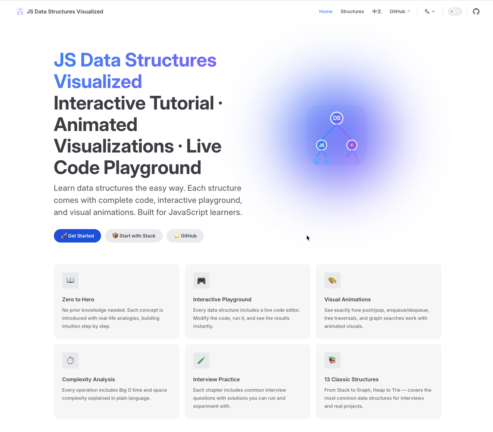
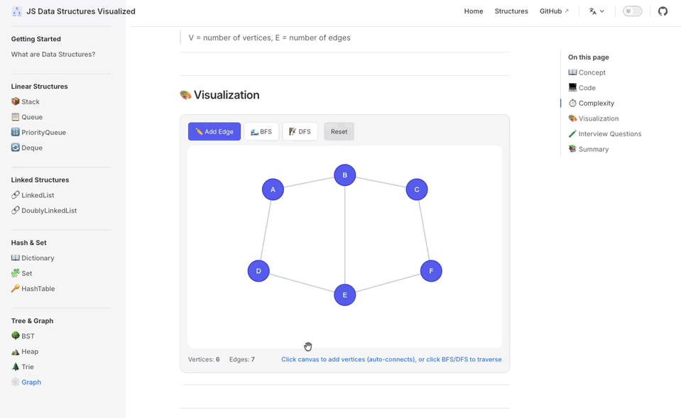

<div align="center">
  
  <h1>JS Data Structures Visualized</h1>
  <p><strong>Interactive Tutorial · Animated Visualizations · Live Code Playground</strong></p>
  <p>🎨 Visual animations &bull; 🎮 Interactive playground &bull; 📖 Zero to interview ready</p>

  <p>
    <a href="https://github.com/yvng-jie/ds-visualized/stargazers">
      
    </a>
    <a href="LICENSE">
      
    </a>
    <a href="https://github.com/yvng-jie/ds-visualized/actions/workflows/deploy.yml">
      
    </a>
    <a href="https://github.com/yvng-jie/ds-visualized/issues">
      
    </a>
    <a href="#">
      
    </a>
  </p>

  <p>
    <a href="https://yvng-jie.github.io/ds-visualized/">🌐 Live Demo</a>
    &nbsp;|&nbsp;
    <a href="#-data-structures">📚 Contents</a>
    &nbsp;|&nbsp;
    <a href="#-local-development">🛠️ Local Dev</a>
  </p>
</div>

---

## 📸 演示

<p align="center">
  
  <br/>
  <em>Website Home</em>
</p>
<p align="center">
  
  <br/>
  <em>Graph git</em>
</p>
---

## 📖 About

An interactive tutorial website for learning data structures in JavaScript. Every chapter includes:

| Module               | Description                                                   |
| -------------------- | ------------------------------------------------------------- |
| 📖 **Concept**       | Real-life analogies, use cases — build intuition in 5 minutes |
| 💻 **Code**          | Complete implementation with teaching-style comments          |
| ⏱ **Complexity**     | Big O time & space for every operation                        |
| 🎨 **Visualization** | Interactive animations with speed control                     |
| 🧪 **Interview Qs**  | LeetCode-style problems with runnable solutions               |

🌐 **English** / 🇨🇳 **简体中文** — Switch languages from the nav bar.

---

## 📚 Data Structures

| #   | Structure                                           | Difficulty | One-liner                    |
| --- | --------------------------------------------------- | ---------- | ---------------------------- |
| 1   | [📦 Stack](docs/stack.md)                           | ⭐         | Last in, first out           |
| 2   | [📋 Queue](docs/queue.md)                           | ⭐         | First in, first out          |
| 3   | [🔢 Priority Queue](docs/priority-queue.md)         | ⭐⭐       | VIPs go first                |
| 4   | [🔄 Deque](docs/deque.md)                           | ⭐⭐       | Insert/remove from both ends |
| 5   | [📖 Dictionary](docs/dictionary.md)                 | ⭐         | Key-value storage            |
| 6   | [🧩 Set](docs/set.md)                               | ⭐⭐       | Unique elements + set ops    |
| 7   | [🔗 Linked List](docs/linked-list.md)               | ⭐⭐       | Nodes + pointers             |
| 8   | [🔗 Doubly Linked List](docs/doubly-linked-list.md) | ⭐⭐⭐     | Forward and backward         |
| 9   | [🔑 Hash Table](docs/hash-table.md)                 | ⭐⭐⭐     | O(1) lookups                 |
| 10  | [🌳 BST](docs/binary-search-tree.md)                | ⭐⭐⭐     | Sorted tree, binary search   |
| 11  | [⛰️ Heap](docs/heap.md)                             | ⭐⭐⭐     | Priority queue done right    |
| 12  | [🌲 Trie](docs/trie.md)                             | ⭐⭐⭐     | Fast string prefix search    |
| 13  | [🕸️ Graph](docs/graph.md)                           | ⭐⭐⭐⭐   | BFS/DFS traversals           |

---

## 🛠️ Local Development

```bash
git clone https://github.com/yvng-jie/ds-visualized.git
cd ds-visualized
npm install
npm run docs:dev     # Start dev server
npm run docs:build   # Build static files
npm run docs:preview # Preview built site
```

---

## 🤝 Contributing

Contributions welcome! Here's how:

- **Submit an Issue** — Bug reports, feature suggestions
- **Submit a PR** — Fix errors, improve translations, add visualizers
- **Translate** — Help expand the English or Chinese tutorials
- **Share** — Star the repo, share with friends!

---

## 📄 License

[MIT](LICENSE) © 2026 Jie Yang
